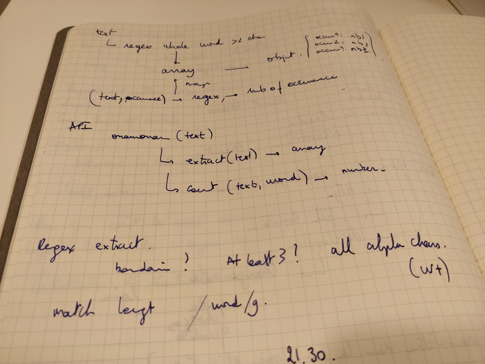

# onamonam

[](https://travis-ci.org/92bondstreet/onamonam)
[](https://coveralls.io/github/92bondstreet/onamonam?branch=master)

> Find number of words occurrence from a text

## Installation

```sh
❯ yarn add 92bondstreet/onamonam
❯ make sandbox
```

## Usage

```js
const onamonam = require('onamonam');

const TEXT = 'In a free hour, when our power of choice is untrammelled and avoided and when nothing prevents our being able to do what we like best, every free hour is to be welcomed and every free hour avoided';
const occurrences = onamonam(TEXT);

console.log(occurrences);
```

## Api

### onamonam(text)

Return `Object` containing occurrence by word

#### text

Type: String

## MDD (Moleskine Driven Development)



## Licence

[Uncopyrighted](http://zenhabits.net/uncopyright/)
